# IoT Dashboard for Smart Building

This project is to help visualize sensors in a smart building as a dashboard application. It was built a Project thesis and part of the [SENSE Project](https://www.projekt-sense.de/) and it has an integrated rule engine.


- The live demo of the application can be [found here](https://iot-dash.netlify.app/).
- The full documentation of the application can be [found here](https://iot-dash-docs.netlify.app/).
- The link to the repository is [found here](https://git.ikt.fh-dortmund.de:3000/IoT_Dashboard/IoT-Dashboard).

## Table of contents

- [Technologies](#technologies)
- [Setup](#setup)
- [Available Scripts](#available-scripts)
- [Application Architecture](#application-architecture)
- [The Dashboard](#the-dashboard)
- [Things](#things)
- [Custom Hooks](#custom-hook)
- [Time Series](#time-series)
- [Routing](#routing)
- [Drawing on the canvas](#drawing-on-the-canvas)
- [Actions](#actions)
- [Rule Engine](#rule-engine)
- [I18n](#internationalization)

## Technologies

The following technologies among others were the used mostly to achieve this project.

- React
- Redux
- Bootstrap
- Javascript
- Json-rules-engine

## Setup

To run this project, install it locally using npm:

```
$ cd <project directory>
$ npm install
$ npm start
```

## Available Scripts

In the project directory, you can run:

### `npm install`

This helps install all the dependencies in the `package.json` file. This should be done in any fresh download or clone of this repository. Ensure you have [NodeJS](https://nodejs.org) installed to be able to run this.

### `npm start`

Runs the app in the development mode.\
Open [http://localhost:3000](http://localhost:3000) to view it in the browser.

The page will reload if you make edits.\
You will also see any lint errors in the console.

### `npm run build`

Builds the app for production to the `build` folder.\
It correctly bundles React in production mode and optimizes the build for the best performance.

The build is minified and the filenames include the hashes.\
Your app is ready to be deployed!

See the section about [deployment](https://facebook.github.io/create-react-app/docs/deployment) for more information.

### `npm run docs`

Builds the documentation of the project which can be accessed in the generated `docs` subfolder.

## Application Architecture

The React application uses a Redux store to hold global application state like the language selected and other global information. The application is itself holds an internationalization framework for changing between the selected languages. Since React is a single-page application, a routing framework is also held within the internationalization framework to help in creating paths to different pages of the application. Each page is then displayed based on the route selected.

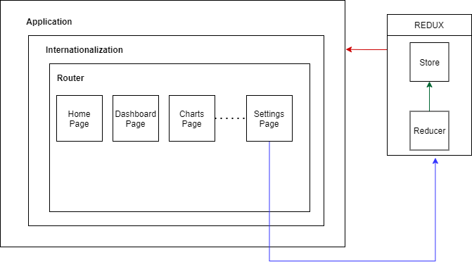

There are a few pages created to serve different purposes in the application. Each of those pages are React components themselves and appear as a stand-alone page due to the routing functions provided by the React-router library.

- [HomePage](https://iot-dash-docs.netlify.app/homepage).
- [DashboardPage](https://iot-dash-docs.netlify.app/dashboardpage).
- [SingleChartPage](https://iot-dash-docs.netlify.app/singlechartpage).
- [MultiChartPage](https://iot-dash-docs.netlify.app/multichartpage).
- [SettingsPage](https://iot-dash-docs.netlify.app/settingspage).
- [ErrorPage](https://iot-dash-docs.netlify.app/errorpage).

Other pages maybe added later in the future.

## The Dashboard

This is the main focus of the application. The dashboard shows information about a particular building whose URL was submitted in the Home page of the application.

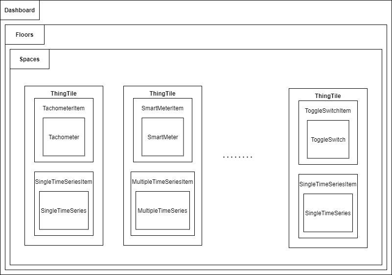

Visually the application is organized so that the floors and spaces are tabs. Each tab can be selected so that only the contents for that tab is viewable at that moment. In the figure below, there is only just one tab for the floors and that tab is used by default because the building has only one storey. Each sensor is represented by a ThingTile which not only shows the sensor current values but also a timeseries graph for the past values of the sensor for a preselected time interval.

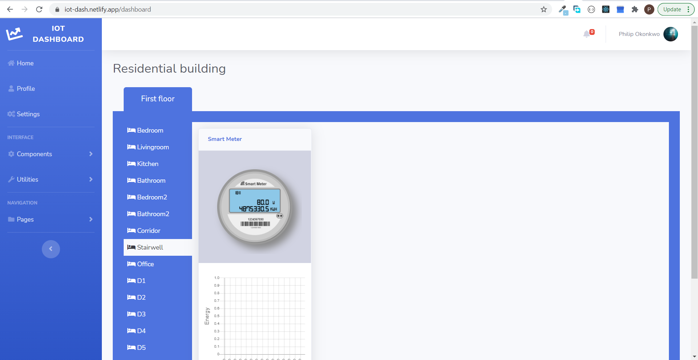

There are a lot of components created to help in displaying information within the dashboard. This includes components that represents floors and rooms as well as components for holding and making calls to fetch actual device data and display them. The components are listed below:

- [Floor](https://iot-dash-docs.netlify.app/floor).
- [Space](https://iot-dash-docs.netlify.app/space).
- [ThingTile](https://iot-dash-docs.netlify.app/thingtile).
- [ToggleSwitchItem](https://iot-dash-docs.netlify.app/toggleswitchitem).
- [ThermometerItem](https://iot-dash-docs.netlify.app/thermometeritem).
- [EnergyMeterItem](https://iot-dash-docs.netlify.app/energymeteritem).
- [TachometerItem](https://iot-dash-docs.netlify.app/tachometeritem).
- [ShutterItem](https://iot-dash-docs.netlify.app/shutteritem).
- [SmartMeterItem](https://iot-dash-docs.netlify.app/smartmeteritem).
- [CompositeMeterItem](https://iot-dash-docs.netlify.app/compositemeteritem).
- [SingleTimeSeriesItem](https://iot-dash-docs.netlify.app/singletimeseresitem).
- [MultipleTimeSeriesItem](https://iot-dash-docs.netlify.app/multipletimeseriesitem).
- [LoadingItem](https://iot-dash-docs.netlify.app/loadingitem).
- [ErrorItem](https://iot-dash-docs.netlify.app/erroritem).

## Things

Since the backend of this application used the [Web of Things](https://www.w3.org/WoT/) architecture, each sensor in the API is represented as a Thing and has its own Thing Description. In the dashboard, each Thing category is even its own visual representation.

#### Thermometer

These are single-property Things just used to measure the temperature in the environment. In the application, temperature sensors are represented as a thermometer. In the source code, the React component that represents this device is called a [Thermometer](https://iot-dash-docs.netlify.app/thermometer).

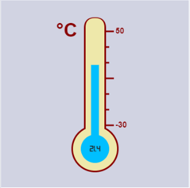

#### Power Meter

These are all the single-property Things that measure just the power values in the application. This include the ones that measure the powers on one phase or all three phases as well as any device. In the application power sensor are represented as a tachometer. In the source code, the React component that represents this device is called a [Tachometer](https://iot-dash-docs.netlify.app/tachometer).

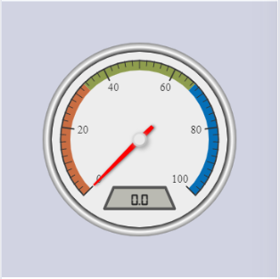

#### Energy Meter

These are single-property Things which display the energy values in the dashboard application. The energy value unit is in Watt-hours (Wh). In the application, energy sensors or meters are represented as an energy meter. In the source code, the React component used to represent energy devices is the [EnergyMeter](https://iot-dash-docs.netlify.app/energymeter).

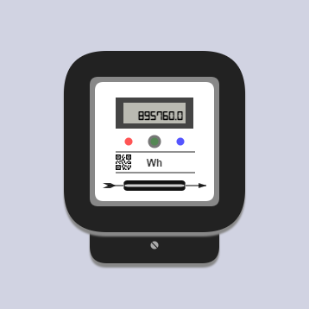

#### Toggle Switch

These are just single-property Things that have two states and toggle between those states. The states can either be true or false. In the application switches are depicted as a toggle switch. In the source code the React component created to represent this is called a [ToggleSwitch](https://iot-dash-docs.netlify.app/toggleswitch).

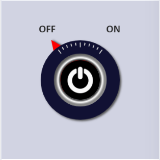

#### Shutter

These are multiple-property Things which display the position and slat angle of a window shutter. The React component used to represent them in the source code is the [Shutter](https://iot-dash-docs.netlify.app/shutter).

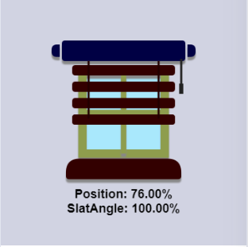

#### Smart Meter

This is a multiple-property Things which reads the power and energy at the same time. It is represented in the application as a round smart meter. In the source code the component that represents it is the [SmartMeter](https://iot-dash-docs.netlify.app/smartmeter).

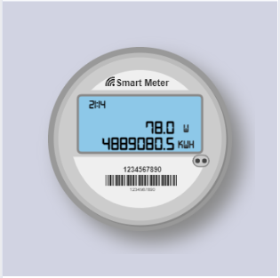

#### Composite Meter

This is also a multiple-property Things that can provide the temperature, power, energy and switch state at the same time. In the application they are represented as a display unit that shows the four values. In the source code the component that represent such sensor is called the [CompositeMeter](https://iot-dash-docs.netlify.app/smartmeter).

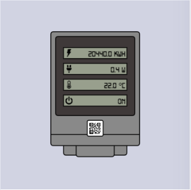

## Custom Hooks

There are a few React custom hooks created mostly to reduce code repetition and make the code cleaner. These hooks perform different functions like animation, storage, network calls etc.

- [useFetch](https://iot-dash-docs.netlify.app/global.html#useFetch)
- [useMultipleFetch](https://iot-dash-docs.netlify.app/global.html#useMultipleFetch)
- [usePrevious](https://iot-dash-docs.netlify.app/global.html#usePrevious)
- [useAnimation](https://iot-dash-docs.netlify.app/global.html#useAnimation)
- [useAnimationTimer](https://iot-dash-docs.netlify.app/global.html#useAnimationTimer)
- [useInterval](https://iot-dash-docs.netlify.app/global.html#useInterval)
- [useLocalStorage](https://iot-dash-docs.netlify.app/global.html#useLocalStorage)

## Historical Data

Each Thing element in the API has an endpoint that retrieves the history of values of that element or Thing. These values are usually given as a JSON array with the time each value was stored and the value at that particular time. The figure below shows a ThingTile holding a thermometer and its singletimeseries component.

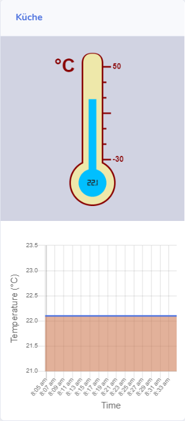

There are two kinds of time series components created for this application.

- [SingleTimeSeries](https://iot-dash-docs.netlify.app/singletimeseries): This is a component used to display a time series graph of the history of values for the single-property items. It is shown with the time values on the x-axis and the specific property of the device on the y-axis. The time interval is usually a preselected value of 1 hour, 1 minute or 1 day depending on the volume of historical data store for that particular device.

- [MultipleTimeSeries](https://iot-dash-docs.netlify.app/multipletimeseries): This is a component used to display a time series graph of the history of values for the multiple-property items. It relies on SingleTimeSeries to display the time series of each property measured by the sensor. And it uses the useInterval hook to switch the display among each time series at regular time intervals.

### Historical Data Detail

The two pages for showing historical data in detail have already been discussed in an earlier section. These are the SingleChartPage and the MultiChartPage which display the detailed historical data for both single-property and multi-property Things.

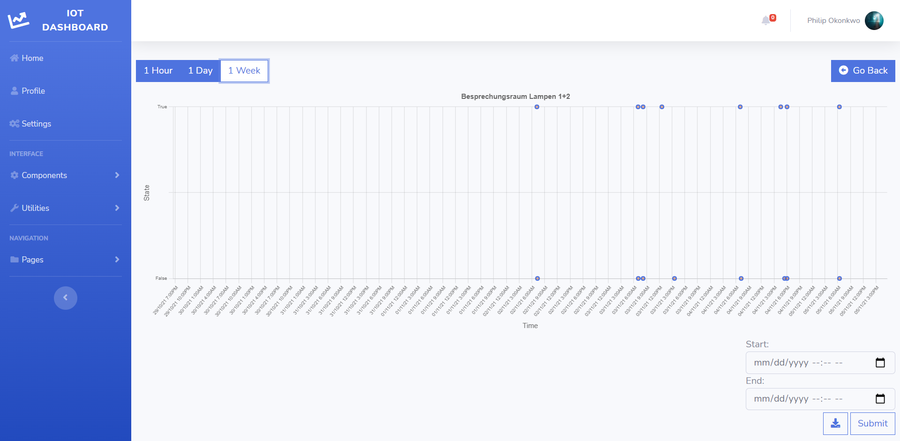

The detail page has buttons for selecting the data displayed to be 1 hour, 1 day or 1 week. Aside from these selectable intervals, there is also support for entering the data as any arbitrary starting and ending date which can be used to fetch historical data within that chosen interval when the “Submit” button is clicked. It is ensured that the start date is always less than the end date so that a valid data is sent to the backend.

There is also support for downloading the historical data that is displayed as a CSV file with
the date and values in separate rows and as an image at the same time. This is achieved by
clicking the download button beside the Submit button in the interface.

## Routing

Routing is achieved through the use of the [React-Router](https://reactrouter.com/) library since URL routing is not supported in React itself. Routing allows us to use the single page application as if it is made of multiple different pages with each page being fetched when the link to them is clicked. The code belows shows part of how routing is achieved in the application. Each page component is placed within a Route component which comes from React Router. The Route component specifies the path to the page. And Switch component wraps the routes and helps to only show the specific path of concern.

```jsx
function App() {
  return (
    <Router>
      ...
      <Switch>
        <Route exact path='/dashboard'>
          <DashboardPage />
        </Route>
        <Route exact path='/profile'>
          <ProfilePage />
        </Route>
        <Route exact path='/settings'>
          <SettingsPage />
        </Route>
        <Route exact path='/single-chart'>
          <SingleChartPage />
        </Route>
        <Route exact path='/chart'>
          <MultiChartPage />
        </Route>
        <Route exact path='/'>
          <HomePage />
        </Route>
        <Route exact path='*'>
          <ErrorPage />
        </Route>
      </Switch>
      ...
    </Router>
  )
}

export default App
```

Two kinds of routing are done in this application. The first one is routing by using the navigation links to a specific page provided and the second is routing by sending information from one page to another. For this kinds of routing, declaring them like above within a route is enough.

The second type of routing is used to send information from the HomePage to the Dashboard page or to send to send information about a specific time series from the TimeSeries page of the SingleChartPage. For this kind of routing, it is not enough to just declare them. React-Router provides its own **custom hooks** for dealing with such a case. The code below shows how data is sent from the HomePage to the DashboardPage.

```jsx
const HomePage = () => {
    const { t, } = useTranslation();
    const history = useHistory();
    const inputRef = useRef(null);

    const onSubmit = (event) => {
        event.preventDefault();
        history.push({
            pathname: '/dashboard',
            state: { url: inputRef.current.value }
        });
    }
    return (
        // Component code.
    )
}
```

React-Router provides the **useHistory** custom hook which is used to push the value of the URL submitted into the Hompage form to the DashboardPage. The `pathname` property in the use history hook represents the path to the DashboardPage. The `state` property holds the value to be sent from the receiving page. The value for the state is an object with a key called `url` which helps to identify and retrieve it in the DashboardPage.

```jsx
const DashboardPage = () => {
  const [url, setUrl] = useState('')
  const location = useLocation()
  const history = useHistory()

  useEffect(() => {
    if (location.state === undefined) {
      history.push('/error')
    } else {
      setUrl(location.state.url)
    }
  }, [location, url, history])

  // Render component body
}
```

The code above shows how the URL is retrieved in the DashboardPage to be used in creating the dashboard. React-router also supplies the **useLocation** which is used to retrieve the value using the `url` property sent in the HomePage.

## Drawing on the canvas

It was necessary to split each sensor component into different layers to help in handling the different HTML canvas optimization concerns listed below.

- Using multiple layered canvases for complex scenes.
- Batching canvas calls together. One of such an example will be to draw a polyline instead of multiple separate lines.
- Rendering screen differences only, not the whole new state.
- When animating, one should prefer window.requestAnimationFrame() instead of window.setInterval().

A good example for illustration is the Tachometer component because it has 3 layered subcomponents. The code block below shows the JSX excerpt from the Tachometer component with the 3 layered subcomponents shown clearly. The 3 layers are the **TachometerFace**, **TachometerIndicatorContainer** and **TachometerCenter** respectively.

```jsx
const Tachometer = ({ value }) => {
  // let the tachometer animate from -5 on initial start
  const [previous, setPrevious] = useState(-5)
  const previousValue = usePrevious(previous)

  useEffect(() => {
    setPrevious(value)
  }, [value])

  return (
    <div className='guage'>
      <TachometerFace />
      <TachometerIndicatorContainer
        value={value}
        previousValue={previousValue}
      />
      <TachometerCenter />
    </div>
  )
}
```

The figure below shows all the layers of the Tachometer visually separated with the TachometerFace on the left, TachometerIndicatorContainer in the middle and TachometerCenter on the right.

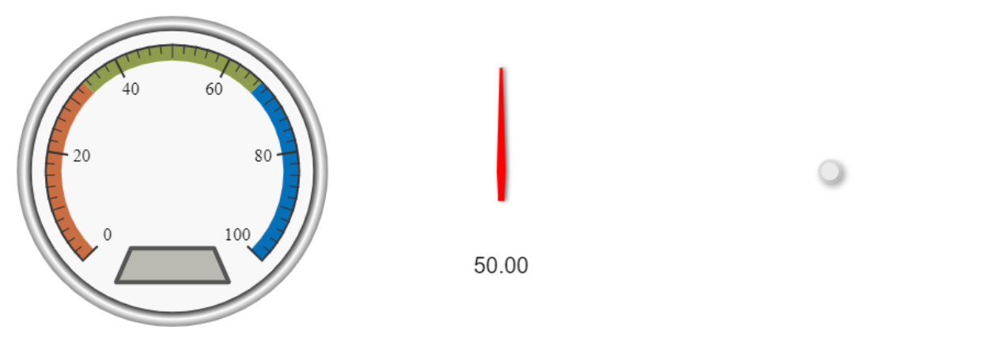

The figure below shows what the same layers look like when combined to make up the whole Tachometer.

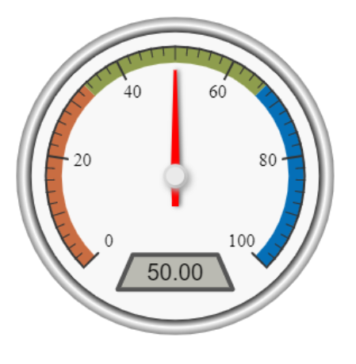

All the animations are done within the **TachometerIndicatorContainer** since it holds the values capable of changing in the Tachometer component. This ensures that whenever a new value is received, the **TachometerFace** and **TachometerCenter** are not re-rendered only the **TachometerIndicatorContainer** is thereby making sure the whole state is not always rendered just the screen difference.
The useAnimation hook is used within the **TachometerIndicatorContainer** component. Since it depends on the useAnimationTimer hook which uses **requestAnimationFrame** function in its implementation, that is another optimization recommendation strictly adhered to.

## Actions

The images shows the action icons for a switch sensor and a temperature sensor respectively. The switch sensor action button is represented by the switch icon on the top left corner of a ToggleSwitchItem while the temperature sensor action button is represented by a thermometer icon on the top left corner of a ThermometerItem. The second icon that looks like a pen and a notepad visible in both figures is for setting the rules for the particular Thing. Rules and Rules Engines are discussed in detail in the next section.

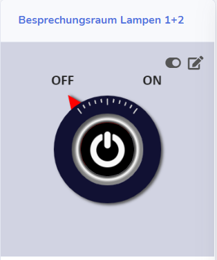
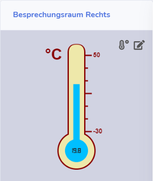

## Rule Engine

The rule engine is a very important part of this application and as such special attention was paid to it to ensure it works perfectly as expected at all times. A few considerations were carried out in selecting the rule engine to be used and implementing it and this includes:

- The rule engine should be implemented on the application front end since there is no direct access to the backend.
- The rule engine should support JavaScript as a corollary to the preceding point.
- A way will be needed to persist the rules created either in a separate server or data base.
  Owing to the considerations above, the **json-rules-engine** library was selected as the best possible way to achieve creating the rules since it just uses a json object to create the rules and that json object can easily be used in React as a JavaScript object.

After that was done, it had to be decided the best possible way to write the rules in the user interface. It was either one of two options:

1. Writing the JSON rules directly in the user interface.
2. Drawing the rules as a diagram in the interface and translating the diagram into the JSON rules when needed.
   Option 2 was chosen because diagrams seemed more intuitive and made it easy to see the rule relationships in the interface. Figure 4.23 shows what the rule diagram in the application looks like and the interface for drawing and saving it.

After this option was chosen a way had to be found to ensure that this diagram is saved somewhere for each specific Thing a rule is created for and is retrievable and applied every time the Thing is visualized in the dashboard.

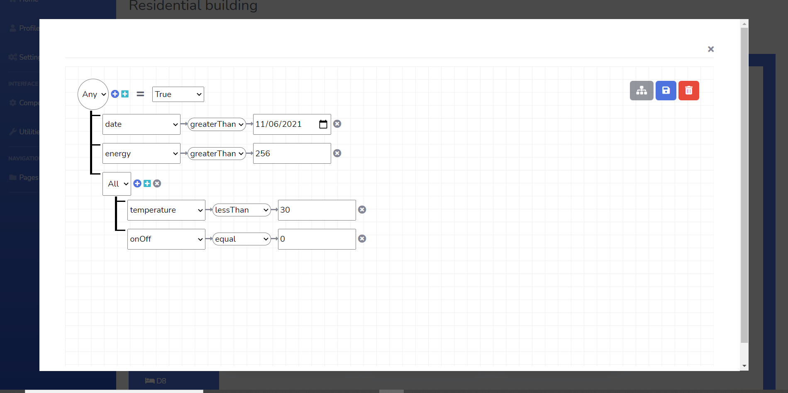

To achieve the foregoing, **Json-Server** was chosen to be the server of choice for testing the rule backend. Json-server is used to create functional fake REST API with no coding. It supports typical CRUD methods like GET, POST, UPDATE and DELETE. The data sent to Json-server is stored as a JSON object in a file called db.json on the server.

The JSON tree diagram is parsed in real-time as it is being created into a JSON format that can be stored in the backend and this JSON output is what is sent when the save button is clicked in the rule diagram interface. When the rule is need to be run, the JSON data is fetched from the backend and then parsed into the Json-rules-engine format so the engine can run the rule and implement results based on the user’s intentions. Figure 4.24 illustrates the workflow for creating the rules and retrieving them later.

## Internationalization

Multiple language support was achieved using [React-i18next](https://react.i18next.com/) which is a framework for implementing internationalization in React applications. It has its own custom hooks for achieving translation between predefined languages and only one of those custom hooks is used in this application.

To be able to use React-i18next, first a file called `i18next.js` is created inside the source folder. The file specifies the language options for the application and the default or fallback language. The `fallbackLng` property specifies the default language and is used if there is no translation found for a particular word. The code block below shows some content in the `i18next.js` file. Here the English version will be used as the default.

```javascript
export const languageOptions = ['English', 'Deutsch']

export default i18n
  .use(Backend)
  .use(LanguageDetector)
  .use(initReactI18next)
  .init({
    fallbackLng: 'English',
    debug: true,
    whitelist: languageOptions,
    interpolation: {
      escapeValue: false,
    },
  })
```

A folder called `locales` is created within the `public` folder of the application and within it, two folder named `English` and `Deutsch` are created to exactly match the names of the languages in the code block above. Within each language folder, a `translation.json` file is created. All the translation files use the same keys but different values corresponding the meaning of a word or sentence in a particular language.

The code block below shows how translation is achieved within the LoadingItem component. The **useTranslation** hook is used to retrieve the value corresponding to the key called `loading` in the translation files.

```jsx
const LoadingItem = ({ url }) => {
  const { t } = useTranslation()

  return (
    <div className='card-body'>
      <div className='loading' title={`${url}`}>
        <div className='loadingcontainer' style={{ fontSize: '18px' }}>
          {t('loading')}... {url}
        </div>
      </div>
    </div>
  )
}
```

The ability to select languages is achieved within the SettingsPage. The **GeneralSettings** in the SettingsPage component uses React-Redux to dispatch information about the selected language to the Redux store that holds the global application state. This forces a re-render of the whole application applcation using the appropriate translation file.

#### Adding new words

To add a new word that will be translated:

- Open the `locales/English/translation.json` file in the `public` folder and add a new key and value pair which corresponds to the words or sentence that should be translated.
- Open each other language folder in the `locales` folder and also add the translation of the same words using the same key used for the English version but with a value that corresponds to the translation of those words in the particular language.

#### Adding New Languages

To add a new language:

- Open the `i18next.js` file in the `src` folder. Add the name of the new languge to the _LanguageOptions_ variable.
- Open the `public/locales` folder and create a new folder named the same way as the name of the language added in the step above.
- Open the newly created folder and add a file called `translation.json`. In the the new json file created, add translations for each of the words in the `English/translation.js` file using the same keys as that in the English translation but with different values corresponding to the language translation of the English word values.

## Learn More

- To learn React, check out the [React documentation](https://reactjs.org/).
- To learn Redux, check out the [Redux Website](https://redux.js.org/).
- To learn React-i18next see the [website](https://react.i18next.com/).
- To learn about React-Router and how it can be used for making a single page application act like it has multiple pages see the [website](https://reactrouter.com/).
